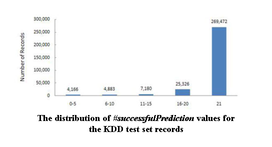

# Information-Security-Service


## Task description

The system being developed should, based on modern artificial intelligence methods, quickly
identify and respond to attacking traffic and report it
The training of the system is supposed to be based on "captured" and processed real-time traffic.
Based on the results of the traffic analysis, the system should report the identified threats by e-mail.
In the future, there will be a connection to the control console in order to view the identified threats
in order to apply foresight.


## Solution notes

- :trident: clean architecture
- :book: standard python project layout 
- :zap: Stack: Django, react, scikit-learn, tensorflow. 
- :card_file_box: Fully included web app with neural model based on tensorflow and sklearn

## The main technology stack:

- :art: React
- :rocket: Django
- :white_check_mark: sqlite
- :lipstick: scikit-learn
- :closed_lock_with_key: tensorflow, keras
- :bookmark: docker, docker-compose

## HOWTO RUN
The project is in docker-compose, so...
```
git clone https://github.com/Simongolovinskiy/currency-converter.git
```
```
docker-compose up --build
```

## The example of our classification model is on screenshot(plot with data)

